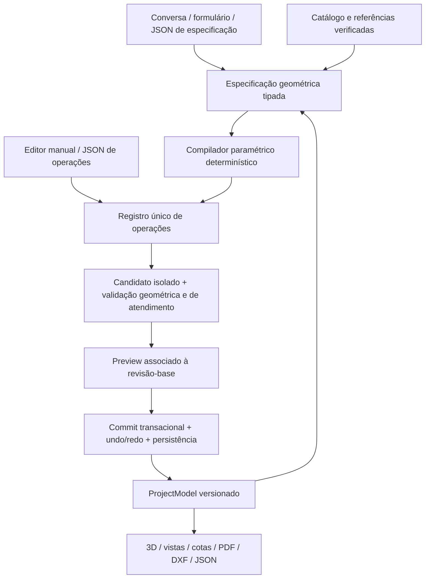

# TASK — Evoluir LED Structure CAD para um produto comercial de esboço geométrico

**Responsável pela implementação:** Claude.  
**Data da especificação:** 19/09/2026.  
**Status:** prototipagem acelerada; F0 parcial e implementação funcional F1–F7 é prioridade. Validação profunda fica para a etapa posterior.  
**Entrada obrigatória:** [AGENTS.md](AGENTS.md).  
**Evidências:** [auditoria do código e testes](docs/AUDITORIA_LED_CAD_2026-09-19.md).

## 1. Resultado esperado

Transformar o aplicativo existente em uma ferramenta profissional para **conceber, desenhar, revisar e documentar a geometria completa de estruturas para painéis LED**. O usuário deve conseguir começar por conversa com IA, formulário, desenho manual, receita de referência ou JSON; continuar em qualquer outro modo; e obter o mesmo projeto editável, cotado, salvo e exportável.

Exemplo de experiência final:

> “Monte um painel de 4 colunas por 2 linhas de gabinetes de 960×960 mm, outdoor, dois postes, base do painel a 3 m, gaiola de 650 mm de profundidade e passarela traseira de 600 mm com guarda-corpo.”

A aplicação interpreta dimensões e relações, lista apenas pendências reais, monta proposta completa em preview e mostra quais componentes foram atendidos. Após Aplicar, o usuário move uma barra manualmente, pede à IA para ajustar somente o guarda-corpo, exporta JSON, reabre e gera prancha da mesma revisão. Se a API falhar, o editor continua funcionando e o desenho permanece íntegro.

Não entregar apenas novo visual, prompt maior, mais presets ou troca de provedor. Entregar comportamento verificável. Reaproveitar o motor existente e evoluí-lo por etapas.

### O que significa “completo”

Completo em relação ao pedido, à tipologia e às premissas exibidas: componentes necessários presentes, medidas coerentes, relações de montagem representadas, sem duplicação acidental e com pendências identificadas. Uma barra criada ou um JSON válido não satisfaz um pedido de conjunto completo.

O produto entrega **esboço geométrico**, não aprovação estrutural. Não ampliar o escopo para cálculo de resistência, vento normativo, fundação dimensionada, preço ou lista de corte. Campos legados dessas áreas devem continuar migráveis; não ocupam o fluxo principal desta evolução. Pranchas identificam estágio do projeto e eventuais dimensões assumidas.

## 2. Regras para executar esta task

### Regime atual — construir antes, validar depois

Estamos em **prototipagem acelerada**. O objetivo desta passagem é implementar o produto descrito nas fases, mantendo o sistema usável, e não fechar uma suíte de qualidade por fase. O executor deve percorrer F1–F7 de forma contínua, reaproveitando a arquitetura existente e fazendo smoke tests apenas para não deixar o aplicativo quebrado.

Os gates, a matriz G01–G30, métricas, corpus de linguagem, testes de concorrência, testes de recuperação, CI e validações detalhadas continuam obrigatórios como plano da próxima etapa, mas são **adiados**. Não criar dezenas de testes, não fazer benchmark, não parar para corrigir testes legados e não aguardar integração real de todos os provedores antes de implementar as funcionalidades. Ao terminar cada área, registrar “implementado; validação profunda pendente”.

Não adiar código essencial de produto: modelo/assemblies, compilador paramétrico, operações, contexto e APIs de IA, referências, editor, JSON, pranchas e exportação devem ser construídos agora. Preservar dados existentes, não expor credenciais e não executar código retornado pela IA continuam regras inegociáveis.

1. Ler auditoria e código atual antes de editar; verificar o workspace já modificado. Não sobrescrever trabalho preexistente.
2. Implementar as fases abaixo em ordem arquitetural, sem deixar a validação de uma fase bloquear o código da próxima. Manter aplicativo utilizável; não criar versão paralela.
3. Fazer smoke test do fluxo alterado quando razoável. Marcar validações profundas como pendentes, sem fabricar aprovações.
4. Atualizar o quadro de progresso com áreas implementadas, smoke tests executados e validações adiadas.
5. Decisões rotineiras de implementação pertencem ao executor. Perguntar somente quando faltar decisão de produto que não possa ser representada como premissa explícita ou opção reversível.
6. Quando testes forem necessários, usar diretório temporário, projetos sintéticos e transportes simulados. Não ler chaves, modificar a sessão ativa, enviar acervo privado para APIs ou publicar/deployar para cumprir a task.
7. Integrações reais de provedores podem permanecer como adaptadores implementados e marcados “pendente de validação”; não bloquear o protótipo por isso.
8. Novos contratos descritos aqui são **propostas a implementar**, não endpoints/campos já disponíveis. Publicar schemas reais e exemplos executáveis quando forem implementados.

## 3. Diagnóstico que orienta as prioridades

Ver detalhes e funções na auditoria. Prioridade imediata:

- Corrigir interpretação de negação, unidades e número de gabinetes: três erros reproduzidos.
- Fazer planejamento realmente não mutante, inclusive atalhos determinísticos.
- Unificar transação, revisão, undo/redo e persistência; impedir preview antigo e aplicação duplicada.
- Validar completude geométrica: hoje uma barra pode ser aceita como projeto completo.
- Controlar expansão e duração: preview corta 121 operações para 120 silenciosamente; grade pode criar quantidade não limitada de barras.
- Medir e reduzir reconstrução de cena, descarte incompleto de materiais e atualizações do DOM por frame.
- Desacoplar modelos de IA do contrato CAD: capacidades de provedor são adaptadas na borda.

Baseline executada: 21 testes existentes, 19 aprovados e 2 falhas (`3000 != 8192` no orçamento de saída Groq). Não corrigir isso simplesmente trocando a expectativa do teste ou aumentando tokens sem avaliar truncamento e complexidade da tarefa.

## 4. Arquitetura de destino dentro do aplicativo existente



A IA decide intenção, componentes, parâmetros e alvos. O Python calcula coordenadas, expande receitas, verifica relações e aplica operações. Desenho livre continua permitido por operações elementares. Não obrigar todo desenho a caber em um preset.

Separar responsabilidades, preferindo expandir módulos existentes:

| Responsabilidade | Base atual | Evolução sugerida |
|---|---|---|
| Documento e invariantes | `models/element.py` | versão, assemblies, parâmetros, relações, transformações |
| Operações/transações | `core/operations.py`, `core/ai_ops.py` | registro único, candidato, commit, revisão, idempotência |
| Intenção e especificação | `services/ai_intent.py` | modelo tipado, unidade explícita, estado de pergunta/resposta |
| Compilação geométrica | `_quick_form_ops`, `PresetBuilder`, handlers | extrair serviço compartilhado de receitas; manter executor |
| Conhecimento | `presets/referencias`, `referencias/` | fichas verificadas, fontes e recuperação por tipologia |
| Provedores | `services/ai_llm.py` | adapters e matriz de capacidades |
| Orquestração | `main.py`, `services/ai_contract.py` | jobs limitados, contexto, validação, retry e cancelamento |
| Editor | `static/index.html` | módulos ES por estado/API/cena/ferramentas/chat/prancha |
| Desenho e exportação | `drawing/`, `export/` | mesma revisão, transformações comuns, cotas associativas |

Nomes novos de módulos são sugestão. Criar somente o necessário para a fase. Não introduzir Redis, banco vetorial, framework de agentes ou novo frontend como pré-requisito.

## 5. Contratos e invariantes de domínio

### 5.1 Documento e montagem

Evoluir `ProjectModel` com migração explícita de arquivos antigos:

- `schema_version`, `project_id` persistente e `revision` monotônica de commit; revisão não retrocede com undo.
- Parâmetros nominais do conjunto e superfícies LED separadas dos membros estruturais. Manter compatibilidade com `panel` singular antigo.
- Assemblies com ID, tipo, transformação local e relação pai/filho: painel, face LED, gabinete, gaiola, suporte, poste, passarela, guarda-corpo, fixação.
- Elementos com ID estável, referência de assembly, geometria, orientação e procedência (`manual`, `generated`, `imported`, `ai`). Seção de representação não significa dimensionamento aprovado.
- Relações tipadas: anexação, alinhamento, simetria, coincidência de interface, offsets e medidas controladoras. Definir quais dirigem regeneração e quais apenas validam.
- Identificar parâmetros derivados, parâmetros editáveis, dimensões assumidas e overrides manuais. Ciclos de dependência e restrições incompatíveis produzem diagnóstico, nunca loop.
- Geometria continua autoritativa no modelo; renderer/exportador não recalculam receitas independentemente.

Não implementar solver CAD genérico como pré-requisito. Começar por dependências determinísticas das montagens LED. Edição manual pode manter vínculo paramétrico ou destacar componente; tornar essa escolha explícita quando afetar regeneração futura.

### 5.2 Unidades, coordenadas e validação

- Número + unidade explícita: `20 mm` → 20; `3 m` → 3000; `1,25 m` → 1250. Definir suporte a cm. Rejeitar números não finitos.
- `4×2 m` difere de `4×2 gabinetes`. Para gabinete 960×960, quatro colunas e duas linhas produzem 3840×1920, antes das folgas declaradas.
- `4×2` isolado usa contexto inequívoco do formulário/projeto; caso contrário pergunta “metros ou gabinetes?”. Não aplicar regra universal “até 50 é metro”.
- Representar `true`, `false`, desconhecido e não aplicável sem colapsar estados. “Sem passarela”, “retire a passarela” e “não altere a passarela” têm efeitos diferentes.
- IDs únicos, dimensões positivas conforme tipo, barras não degeneradas, referências existentes, eixos válidos, contagens inteiras com limites e coplanaridade real da grade.
- Tolerância geométrica documentada, inicialmente 0,1 mm para verificações de coincidência; não arredondar geometria salva para a precisão de exibição.
- Distinguir duplicata acidental, contato esperado e interferência. Duas barras que se tocam numa ligação não são automaticamente colisão inválida.
- Não conectar nem mover peças somente por proximidade: usar relações e alvo explícitos, inclusive ao elevar postes.
- `ground_clearance` é cota inferior da referência do painel; suporte e montagem podem ter offsets explicitamente modelados. Coerência deve seguir vínculos da tipologia, sem impor coincidência incorreta a toda montagem.

### 5.3 Operações e envelopes

Preservar compatibilidade com `{ "explain": "...", "ops": [...] }` na resposta atual do copiloto e `operation` como discriminador. Evoluir por versão negociada; não aceitar campos novos silenciosamente no contrato antigo.

Publicar três schemas identificáveis e exemplos separados:

1. **Documento de projeto:** exportação/importação completa e migrável.
2. **Especificação geométrica:** intenção e parâmetros para o compilador.
3. **Plano de operações:** comandos validados para preview/commit.

Importação identifica explicitamente o tipo. JSON inválido mostra caminho (`ops[2].end.z`), erro e possibilidade de corrigir. Sem `eval`, coerção silenciosa ou descarte de campos desconhecidos. Arquivo de versão futura deve falhar com orientação, preservando o original.

Contrato proposto de aplicação, a adaptar ao endpoint existente:

```json
{
  "project_id": "demo-led-01",
  "base_revision": 12,
  "plan_id": "plan-demo-01",
  "idempotency_key": "apply-demo-01"
}
```

`plan_id` identifica candidato/ops imutáveis guardados pelo backend, com hash do conteúdo, projeto, revisão-base, versão de schema/receita e prazo de validade. Se houver edição do JSON depois do preview, gerar outro plano. Não confiar em hash informado pelo cliente como prova de validação.

Aplicação manual pode usar comando/lote direto com revisão-base e idempotência, passando pela mesma transação. Não obrigar preview para cada movimento de mouse. Importação substitutiva, regeneração e propostas da IA mostram diff e têm Aplicar explícito.

Retornos incluem nova revisão e diff; erro tem código, mensagem, etapa, caminho de campo quando aplicável e indicação de possibilidade de repetir. Usar códigos HTTP adequados: conflito 409, limite 413/422 conforme caso, sem fingir HTTP 200 de sucesso com erro opaco.

### 5.4 Transação, histórico e concorrência

1. Capturar snapshot imutável da revisão-base.
2. Normalizar e validar limites antes da expansão.
3. Executar no candidato; validar documento, topologia, escopo e atendimento.
4. No commit, conferir projeto/revisão novamente dentro da seção crítica.
5. Persistir e trocar estado segundo política transacional documentada; criar exatamente um registro de histórico/undo para a ação composta.

Falha não altera modelo, revisão, undo/redo ou sessão salva. Reenvio da mesma chave e mesmo payload retorna o resultado original; mesma chave com payload diferente é conflito. Definir retenção dessas chaves e comportamento após reinício, com teste de “commit realizado, resposta perdida”.

Escolher inicialmente SQLite transacional ou arquivos com substituição atômica, índice consistente e journal; documentar decisão. O banco Prisma da raiz não deve virar dependência por conveniência. Testar erro de disco, escrita interrompida e recuperação.

Não manter lock durante chamada LLM ou exportação pesada. Trabalho usa snapshot; commit é curto. Isolar por projeto/sessão. Até existir armazenamento compartilhado apropriado, documentar execução suportada em processo único e impedir configuração que prometa múltiplos workers com STORE em memória.

### 5.5 Completude e explicação curta

Toda proposta informa:

- pedido entendido, unidades e dimensões finais;
- componentes solicitados/presentes/pendentes;
- premissas usadas e suas origens;
- alterações locais/globais, itens preservados e removidos;
- problemas que impedem aplicar e avisos não impeditivos.

Proposta incompleta não recebe selo de completa. Se só parte é possível, pode ser revisada como parcial claramente identificada; não eliminar requisitos para fazer o validador passar. A explicação é resumo verificável, não cadeia de pensamento.

## 6. Fases de implementação e gates

### F0 — Baseline reproduzível e plano de intervenção

**Entregar:**

- Manifesto Python com versões/faixas compatíveis e instalação reproduzível; verificar o Python alvo e manter comando Windows documentado. Não instalar pacotes no ambiente global para mascarar dependências ausentes.
- Configuração de diretório de dados de teste/produção, paths independentes do CWD e logs UTF-8.
- Comandos claros para modo direto `FastAPI:3000` e modo shell `Next:3000 → FastAPI:3100`; gateway opcional tem finalidade documentada.
- Reproduções automatizadas A01–A09 e registro das duas falhas existentes. A decisão sobre tokens deve ser explícita.
- Instrumentação inicial: request/job ID, projeto/revisão, duração de interpretação, provedor, validação, compilação, diff, persistência, cena e exportação. Registrar contagens/tempos, nunca chaves ou raciocínio privado.
- Fixtures sintéticas de 100, 1.000 e 5.000 elementos; benchmark inicial de CPU/UI/memória e hardware/browser documentados.

**Gate F0:** outro desenvolvedor instala e roda sem depender da sessão privada; reproduções e relatório distinguem falha atual de comportamento esperado. Registrar testes ainda vermelhos sem ocultá-los.

### F1 — Estabilidade do documento, transações e interface

**Entregar:**

- Resolver A04–A07, A09 e riscos A13–A19 pelos contratos da seção 5. Uma única pilha backend de undo/redo e uma transação para toda ação composta.
- Fazer `/api/ai/plan` livre de mutação, inclusive desfazer/regen/preset. Ação de desfazer executa pela ação explícita correspondente; planejar não executa utilidades mutantes.
- Revisão-base, projeto, idempotência e invalidação de preview ao editar/trocar documento. Resposta tardia de IA não pode reaparecer sobre outro projeto.
- Persistência com estado visível “salvando/salvo/falhou”; recuperação e snapshots consistentes. Migrar cópia, manter backup e preservar arquivo original em falha.
- Cancelamento na UI, deadline total e descarte de respostas antigas. Cancelar fetch sozinho não cancela backend: token/job precisa parar etapas posteriores e impedir commit; quando upstream não for cancelável, informar esse limite e descartar resultado.
- Limites configuráveis de bytes de entrada/saída, operações, elementos expandidos, tempo e profundidade de JSON. Sugestão inicial: 5 MB de documento, 120 ops por plano e 10.000 elementos; calibrar por medições. Rejeitar antecipadamente; nunca executar só o prefixo.
- Primeiras correções de cena: descarte de materiais/geometrias exclusivos, ciclo correto de recursos compartilhados, estatísticas atualizadas por mudança e prevenção de handlers duplicados.
- Remover cálculo de BOM/vento do caminho crítico do editor geométrico, preservando compatibilidade de endpoints legados quando necessária.

**Gate F1:** falhas e concorrência não corrompem projeto; sequência apply/undo/redo restaura estado; cancelamento libera UI; limites não congelam browser; nenhuma regressão dos três modos de entrada.

### F2 — Especificação e compilador paramétrico completo

**Entregar:**

- Corrigir A01–A03; extrair geração de `_quick_form_ops` e presets para compilador compartilhado. Formulário, JSON e IA usam o mesmo modelo de especificação.
- Criar receitas versionadas com parâmetros explícitos e invariantes para tipologias iniciais: outdoor com um/dois postes; parede/fachada; suspenso; rental/totem simples.
- Montar gabinete/grade, quadro frontal e traseiro, travessas de profundidade, suportes solicitados, contraventamentos declarados, passarela e guarda-corpo. Acessórios omitidos no pedido seguem receita declarada ou pendência; não aparecem por adivinhação.
- Definir interfaces de fixação como geometria de esboço: placas, pontos/furos quando parametrizados, offsets e orientação. Não dimensionar ancoragens por IA.
- Acrescentar relações de assembly e parâmetros persistentes. Regeneração atualiza apenas o assembly alvo, respeita overrides, locks e IDs estáveis quando a identidade é mantida.
- Suportar receitas extensíveis e operações livres para formas não catalogadas. Fase F6 estende a dupla face e circular; não rotular uma linha de barras em círculo como toda a estrutura circular.
- Validadores de atendimento com erros tipados: dimensão incompatível com modulação, item solicitado ausente, suporte desconectado, duplicata, referência quebrada, dependência inconsistente e limite excedido.

**Gate F2:** mesmo spec via formulário/JSON/IA simulada gera mesma geometria normalizada; todo pedido completo do corpus inicial produz montagem completa; pedidos incompletos geram perguntas úteis ou premissas declaradas. Fixture principal da seção 7 aprovada.

### F3 — Copiloto confiável por API

**Entregar:**

- Estado de conversa associado ao projeto e à revisão: interpretar → pedir esclarecimento quando necessário → planejar → validar → preview → aplicar/cancelar. Uma resposta a esclarecimento continua o pedido anterior; conversa não é apenas histórico visual no DOM.
- Escolher rota adequada: criação/alteração global usa spec/compilador; edição local usa operações tipadas e seleção; pergunta informativa usa resposta própria. Não inferir pergunta apenas por `?` no texto de explicação.
- Contexto com documento resumido, parâmetros, assemblies, seleção, vizinhança relevante e fontes. Paginar/recuperar entidades necessárias; sinalizar resumo e limites. Seleção múltipla deve chegar inteira ou produzir aviso explícito.
- Registro único gera schema/documentação de ferramentas. Implementar consultas limitadas ao modelo quando necessárias: obter assembly, elementos, medidas e catálogo. Consultas são leitura; mutações continuam no plano.
- Adapters por protocolo. Preservar OpenAI-compatible/Groq/Z.ai existentes. Permitir Claude nativo mediante adapter próprio e teste contratual; não assumir que `/chat/completions` funciona em toda API.
- Capabilities verificadas por conexão/modelo: structured output, ferramentas, visão, streaming, parâmetros de raciocínio, limite de contexto/saída. Esconder opções não suportadas e explicar incompatibilidades.
- Resultado normalizado contém conteúdo, motivo de término, uso quando informado e erro sanitizado. Detectar recusa, resposta vazia, JSON truncado e limite de saída. Nunca “consertar” JSON cortado e aceitar uma estrutura incompleta.
- Prazo total configurável por trabalho, inicialmente 90 s; no máximo duas tentativas de geração no caminho padrão, compartilhando o prazo. 401/403/402 não geram repetição automática; 429 respeita Retry-After apenas se couber no prazo. Sem cascata de retries no cliente, gateway e backend.
- Job limitado com estados reais (`queued`, `running`, `validating`, `ready`, `failed`, `cancelled`, `expired`), identificador e cancelamento. Polling basta inicialmente; SSE opcional. Estado de UI não depende de inventar progresso baseado em segundos.
- Resumo antes de Aplicar, comparação visual e erro por etapa. Não trocar de conexão nem substituir falha da IA por preset silencioso.

**Gate F3:** corpus de linguagem e cenários de falha passam; conexão indisponível não bloqueia modo manual/JSON; nenhum payload inválido produz mutação; capacidades de provedores têm testes independentes; relatório distingue provedor simulado de real.

### F4 — Conhecimento técnico das referências

**Entregar:**

- Inventário local deduplicado por conteúdo, preservando diferentes revisões/tipologias; não deduplicar só por largura/altura. Começar pelo catálogo e acervo existentes.
- Ficha de referência com ID, família, uso indoor/outdoor, dimensões/modulação verificadas, componentes, parâmetros reutilizáveis, limites, procedência por arquivo/página e status de revisão humana.
- Selecionar ao menos cinco exemplos representativos disponíveis: poste, parede, suspenso/rental, dupla face e totem/circular. Se uma família não tiver documento legível, registrar lacuna; não fabricar medição para preencher meta.
- Pipeline de leitura local com extração de texto/vetores quando viável. OCR ou visão produzem dados candidatos, com verificação de escala/unidade e procedência. Não enviar lote de referências privadas para serviço externo sem autorização.
- Transformar conhecimento confirmado em receitas e regras versionadas. PDF de orçamento pode inspirar organização geométrica, mas não vira fonte automática de cálculo ou aprovação.
- Recuperação inicial por metadados/texto, suficiente para o tamanho do acervo; embeddings são opcionais mediante necessidade medida. Informar quais referências sustentaram a proposta e quais dimensões são do usuário.
- Fontes externas de desenho via API entram por adapter: especificação ou entidades normalizadas → validação → preview. Identificar versão, unidade e origem; cache por conteúdo. Ferramenta externa não escreve direto no STORE.

**Gate F4:** proposta baseada em referência cita ficha/página rastreável; alterar a escala não copia cotas antigas; referência contraditória vira pendência; remover internet não inutiliza catálogo local/manual/JSON.

### F5 — Editor manual e JSON com fluidez

**Entregar:**

- Modularizar frontend atual sem perda funcional: cliente API, estado, renderização, seleção/snaps, comandos, painel JSON, copiloto e prancha.
- Atualizar cena por ID/diff e preservar câmera/seleção quando possível. Reutilizar geometrias/materiais com ciclo de vida explícito. Considerar instancing após benchmark, mantendo seleção por entidade e cores de preview.
- Renderização por demanda ou agendamento de frames necessários, incluindo damping, gizmo e resize. Evitar processamento pesado por pointermove; snap com índice/cache e descarte de resposta antiga.
- Desenho A→B, coordenadas e medidas numéricas, snaps previsíveis, plano de trabalho, copiar, mover, rotacionar, espelhar, selecionar por janela, grupos, ocultar/isolar e bloquear elementos.
- Vistas ortográficas consistentes com prancha. Para perfis retangulares e chapas orientadas, aplicar a mesma transformação geométrica em 3D e exportação.
- Painel JSON com tipo/schema, validação, mensagens por caminho, carregar exemplo, simular e aplicar; importação de documento tem diff/substituição identificada e undo. Arquivo inválido não apaga projeto aberto.
- Ferramentas habilitadas conforme seleção, atalhos documentados e foco correto: Delete/atalhos de CAD não agem enquanto se digita no chat/JSON.
- UI clara para esperando IA, cancelado, plano vencido, conflito, erro de salvar e recuperação. Botões antigos do chat referenciam seu próprio plano ou ficam desabilitados; não aplicam o `pendingPlan` global mais recente por engano.

**Gate F5:** sessão contínua de 30 min com desenho/edição/IA simulada/importação/undo/exportação sem erro não tratado ou perda; métricas da seção 8 satisfeitas ou limitação objetiva registrada como impeditiva do lançamento pretendido.

### F6 — Famílias avançadas e prancha dimensional

**Entregar:**

- Dupla face com duas referências LED, estrutura compartilhada, distância/orientação explícitas e seleção por face. Não duplicar estrutura inteira por acidente.
- Circular/poligonal: raio/diâmetro, plano, discretização declarada, quadro/suportes e modulação compatível ou pendente. Não prometer gabinete curvo inexistente no catálogo.
- Evoluir totem/rental conforme referências verificadas; base, rodas ou acessórios são geometrias opcionais parametrizadas, sem afirmação de estabilidade calculada.
- Prancha da revisão fixada: frontal, traseira, laterais quando necessárias, superior, inferior, isométrica e detalhes relevantes. Vistas não aplicáveis podem ser omitidas justificadamente.
- Cotas associativas de largura/altura/profundidade, elevação, modulação, espaçamento/eixo de postes, offsets, passarela, guarda-corpo e barras/componentes que exigirem identificação. Cotas derivadas do modelo, não de texto da IA.
- Hierarquia visual, escala declarada, unidades, legenda, carimbo, revisão e estágios/premissas. Quebra em folhas/detalhes para evitar texto sobreposto e cortado.
- PDF/SVG vetoriais legíveis; DXF em mm com layers e entidades suficientes para edição; JSON completo. Verificar round-trip onde suportado; não anunciar exportação DWG nativa sem implementação.
- Exports usam o mesmo snapshot mesmo que usuário continue editando. Cache invalidado por revisão e configuração de desenho.

**Gate F6:** dimensões numéricas coincidem entre JSON, 3D e cotas; arquivos abrem em leitores independentes; dupla face/circular permanecem editáveis nos três modos; pranchas aprovadas em inspeção visual com projetos pequenos e densos.

### F7 — Empacotamento e qualidade de lançamento

**Entregar:**

- Instalação e inicialização reproduzíveis no Windows, healthcheck, diagnóstico de portas/dependências e configuração local segura. Documentar atualização, backup, recuperação e compatibilidade.
- Editor sem IA funciona offline; dependências visuais locais. API key permanece backend, mascarada na UI e removida de logs/exports. Política de armazenamento local de segredo explícita.
- Validar nomes/caminhos de importação/exportação, limites, URLs de conectores, conteúdo inserido no DOM e escape de SVG/HTML. Impedir exfiltração de chave por redirecionamento HTTP indevido; não aceitar HTML retornado por IA como interface.
- Modo local fica em loopback. Exposição em rede só é considerada suportada com autenticação, autorização por projeto, isolamento, origens permitidas, proteção de mutação e configuração revisada. CORS sozinho não é autenticação. Não fazer deploy como parte desta task.
- Rotas de leitura não mudam sessão/projeto. Deprecar GETs mutantes com compatibilidade documentada e prazo.
- CI com testes de domínio, contrato/API, migrações, exports e fluxo de navegador. Qualidade do shell deve ser verificada se alterado; não depender de `ignoreBuildErrors` para publicar mudanças.
- Documentação do usuário, JSON schemas/exemplos, catálogo/receitas, limites conhecidos, formato dos projetos e roteiro de suporte.
- Relatório final ligando cada gate a evidência; diferenças em relação às metas precisam de decisão explícita de escopo, nunca “aprovado” automático.

**Gate F7:** instalação limpa + corpus completo + sessão de estabilidade + recuperação + exports aprovados. Recursos sem integração real validada são identificados; não chamar o conjunto inteiro de comercialmente pronto enquanto houver bloqueador nesses gates.

## 7. Fixture geométrica de referência e aceites funcionais

### Fixture principal, sintética e sem validade de dimensionamento

Parâmetros: quatro colunas, duas linhas, gabinete 960×960 mm, folga zero, painel 3840×1920, base Z=3000, gaiola com frente Y=0 e traseira Y=650, centrada em X=0. Topo Z=4920. Dois postes em X=-960/+960, Y=325, do solo à interface Z=3000. Travessas de interface conectam postes ao quadro inferior. Passarela traseira Y=650…1250, largura 3840, piso de referência Z=3000; guarda-corpo com altura geométrica de exemplo 1100, parametrizada e marcada como premissa de teste.

Frente e traseira têm quadro sem duplicata das bordas e modulação em X=-1920,-960,0,960,1920 e Z=3000,3960,4920. Ligações de profundidade e contraventamentos seguem receita explícita. O teste deve conferir componentes e vínculos, não só número total de barras. Piso pode ser superfície geométrica, com estrutura de apoio distinta; não inventar especificação de chapa/piso.

JSON ilustrativo da futura entrada de especificação — **não é importável no código atual**:

```json
{
  "document_type": "led_structure_spec",
  "schema_version": 1,
  "units": "mm",
  "intent": "new",
  "family": "outdoor_posts",
  "panel": {
    "columns": 4,
    "rows": 2,
    "cabinet_width": 960,
    "cabinet_height": 960,
    "gap_x": 0,
    "gap_z": 0,
    "ground_clearance": 3000
  },
  "cage": {"enabled": true, "depth": 650},
  "supports": {
    "count": 2,
    "positions": [{"x": -960, "y": 325}, {"x": 960, "y": 325}]
  },
  "walkway": {"enabled": true, "side": "rear", "depth": 600},
  "guardrail": {"enabled": true, "height": 1100},
  "assumptions": [
    {"path": "guardrail.height", "source": "synthetic_fixture", "review_required": true}
  ]
}
```

Publicar schema implementado e fixture ajustada juntos. Nenhuma medida de exemplo vira regra universal de produto.

### Matriz obrigatória de aceites

| ID | Cenário | Resultado exigido |
|---|---|---|
| G01 | Fixture por formulário, spec JSON e IA simulada | mesmo modelo geométrico normalizado, mesmas relações e medidas |
| G02 | “sem passarela e sem guarda-corpo” | ambos ausentes; `false` preservado |
| G03 | “base a 20 mm”, “1,25 m”, “4×2 m” | conversão correta; nenhuma heurística vence unidade |
| G04 | “4×2 gabinetes 960×960” | 3840×1920, modulação correta |
| G05 | “4×2” sem contexto | pergunta objetiva; resposta posterior completa mesma intenção |
| G06 | elevar conjunto de 3000 para 3500 | +500 na montagem vinculada, bases no solo, outros conjuntos intactos |
| G07 | mover apenas barra selecionada | só alvo/derivados explicitamente vinculados mudam; sem `__blank` |
| G08 | aumentar de 2×1 para 4×2 gabinetes | uma montagem atualizada; sem gaiola sobreposta; overrides preservados ou conflito apresentado |
| G09 | apenas uma barra em resposta a projeto completo | incompletude detectada e não anunciada como sucesso completo |
| G10 | elemento bloqueado durante regeneração | respeita lock ou expõe conflito; não sobrescreve |
| G11 | plano criado, edição manual, Apply antigo | 409/plano obsoleto; regenerar preview explicitamente |
| G12 | troca de projeto durante IA | resposta não aparece/aplica no projeto novo |
| G13 | clique duplo e repetição após resposta perdida | um commit, uma revisão, um undo |
| G14 | falha na última operação do lote | modelo, histórico e arquivo intactos |
| G15 | lote com reset/preset + barras | um undo restaura projeto e metadados integralmente |
| G16 | três ações, dois undo, dois redo | estados exatos; nova edição invalida ramo redo corretamente |
| G17 | 121 operações ou grade acima do limite | erro explícito antes de expansão; preview/apply concordam |
| G18 | NaN/Infinity, ID duplicado, dimensão negativa, grade colinear | rejeição identificável sem mutação |
| G19 | recusa, JSON cortado, saída vazia, timeout, 429, 401/403/402 | estados e mensagens corretos; sem loop/fallback silencioso |
| G20 | cancelar IA antes/depois do retorno upstream | nenhum plano tardio aplicado; UI utilizável |
| G21 | exportar/reimportar documento e migrar legado | preserva geometria/IDs/vínculos/premissas; original não perdido |
| G22 | queda durante escrita e disco sem permissão | última revisão íntegra recuperável; falha de salvar visível |
| G23 | duas abas editam mesma revisão | um commit vence, outro recebe conflito; sem atualização perdida |
| G24 | salvar mudança geométrica com mesmo BOM | nova revisão detectada por documento, não por resumo de material |
| G25 | duas faces e circular | faces/assemblies corretos, edição local e exports consistentes |
| G26 | PDF/DXF de projeto aberto enquanto usuário edita | arquivo mantém revisão capturada e dimensões coerentes |
| G27 | documento com strings HTML/script e referência maliciosa | texto tratado como dado; nenhum código/instrução executado |
| G28 | IA desligada/internet ausente | desenhar, editar, salvar, importar JSON e exportar continuam disponíveis |
| G29 | seleção inclui elemento além dos primeiros 60 | alvo correto chega à IA; sem substituição por elemento semelhante |
| G30 | cotas e peças assimétricas/rotacionadas | frente/trás/laterais sem espelhamento incorreto; seção e orientação coerentes |

Testes de geometria usam modelo real; transporte de IA pode ser simulado. Testes reais de API medem interpretação e adequação do provedor, não a correção básica do motor. Incluir corpus inicial de pelo menos 30 pedidos em português com variações de unidade, negação, tipologia, seleção e continuidade, com resultados esperados versionados.

## 8. Metas de desempenho e método de medição

Metas iniciais de aceite, **ainda não medidas nesta auditoria**. Registrar CPU, RAM, GPU, SO, browser, versão do app, viewport e fixture; executar aquecimento e ao menos 30 amostras para operações locais. Não incluir latência externa de LLM na métrica do motor.

| Operação | Meta inicial |
|---|---|
| resposta visual a seleção/arraste, 1.000 elementos | p95 até 100 ms |
| órbita/arraste, 1.000 elementos | frame p95 até 33 ms no hardware de referência |
| comando local simples completo, 1.000 elementos | p95 até 300 ms, incluindo persistência local |
| compilar/validar/preview fixture até 1.000 elementos | p95 até 1 s, excluindo IA |
| abrir projeto de 5.000 elementos | até 3 s no hardware de referência; interface com estado explícito |
| cancelar job na interface | feedback até 250 ms; impedir uso de resultado tardio |
| PDF de seis vistas, 1.000 elementos | até 5 s ou execução em job cancelável sem bloquear editor |
| 100 ciclos criar/aplicar/undo/cancelar preview | sem crescimento monotônico de recursos; contadores estabilizam após aquecimento |

Monitorar `renderer.info`, heap quando disponível, draw calls, objetos/listeners e long tasks. Memória bruta varia por GC; comparar tendência e recursos vivos, não exigir valor mágico de MB. Se o hardware não atingir a meta, registrar medição e fazer otimização dirigida; não reduzir tamanho do corpus para declarar sucesso.

Confiabilidade da IA: medir acerto de intenção, contrato válido, atendimento completo, preservação de escopo, taxa de esclarecimento, latência e tentativas por provedor. Meta inicial para pedidos não ambíguos do corpus: ≥95% de propostas completas após até uma correção; publicar tamanho da amostra e repetições. Corpus ambíguo precisa perguntar corretamente. Essa taxa não substitui a exigência de **zero mutações indevidas** em testes determinísticos.

## 9. Entregáveis e conclusão

- Código integrado ao aplicativo existente, com migrações e compatibilidade documentadas.
- Schemas versionados, exemplos reais executáveis e catálogo de operações gerado do registro.
- Receitas e fichas de referência com procedência, revisão e testes de geometria.
- Suítes de domínio, concorrência, integração, navegador e exportação; fixtures sintéticas e benchmark reproduzível.
- Manual de instalação/uso/recuperação, limites de cada provedor e diagnóstico exportável sem segredos.
- Relatório por gate: o que mudou, comandos/testes, medições, arquivos de evidência e limitações.

| Fase | Dependência | Estado inicial | Evidência de conclusão |
|---|---|---|---|
| F0 | — | **concluído (protótipo)** | requirements.txt; tests/test_f0_repro.py 9/9; baseline 21 testes (19 ok, 2 falhas `3000 != 8192`) |
| F1 | F0 | **implementado; validação profunda pendente** | `core/operations.py` (revisão monotônica, idempotência, persist_state A17), `main.py` (409 em revisão-base desatualizada, undo com commit), A04–A07/A09 corrigidos e verdes |
| F2 | F1 | **implementado; validação profunda pendente** | `services/parametric.py` (NOVO: compile_spec + intent_to_spec), endpoint `/api/compile/preview`; fixture 4×2 960×960 → 41 ops/43 elems com grupos e undo em 1 passo; formulário passa a usar o compilador |
| F3 | F2 | **parcial; validação profunda pendente** | `ai_plan`: pedidos `new`/`global_resize` completos usam compilador determinístico (engine=compiler, completude+assumptions no preview); log CP1252 corrigido; conexões/LLM inalterados |
| F4 | F2/F3 | pendente | — |
| F5 | F1/F3 | pendente | — |
| F6 | F2/F4/F5 | pendente | — |
| F7 | F0–F6 | pendente | — |

### Continuidade

Esta especificação registra o desenho arquitetural e o estado de F0–F3. A tarefa ativa, com prioridades de interface, prancha técnica de sete folhas, apresentação comercial e IA CAD, é [TASK_CLAUDE_LED_CAD_PROTOTIPO_FINAL.md](TASK_CLAUDE_LED_CAD_PROTOTIPO_FINAL.md).
